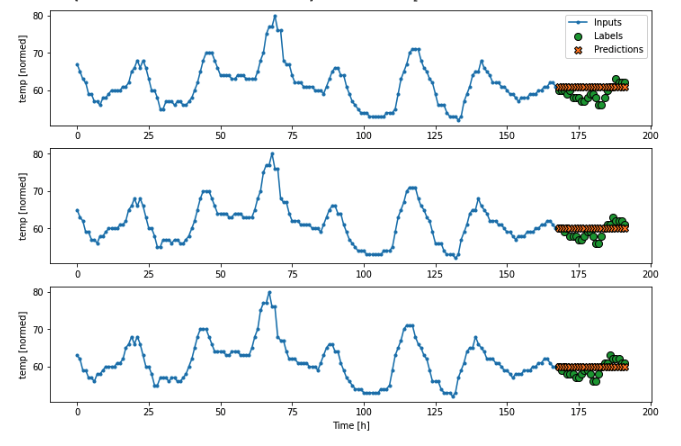

# Using deep learning to predict the temperature of the next 24 hours at the Ronald Reagan National Airport

## **Abstract**

Weather forecasts are an integral part of our day-to-day lives. They
help us plan ahead and be prepared for the upcoming hours, days and even
weeks. We use the weather apps on our phones to check tomorrow’s
temperature or the chances of rain in order to dress appropriately or to
make sure we take our umbrellas with us. These are all weather forecasts
that we use regularly without giving a second thought.  
As it is such an important part of our lives, the accuracy of these
forecasts are very important. Not all weather forecasts are made equal
as meteorologists use a variety of approaches and a wide range of data
to make predictions.  
One emerging approach in the field of weather forecasting is the use of
machine learning to make predictions. The abundance of data being
collected these days and the increasing advancements in machine learning
algorithms make this a task that machine learning is really suited
for.  
This project is an attempt in using machine learning (deep learning in
particular) to make hourly weather forecasts for each day at Washington
D.C.

## **Problem Definition and Algorithm**

### **Task Definition:** 

Using historical hourly weather data of the previous 7 days, predict the
temperature for the next 24 hours (12am to next day’s 12am).

### **Source of Data**

**URL:**
[Wunderground](https://www.wunderground.com/history/daily/us/va/arlington/KDCA/date/2022-12-12)  
Under the hood, Wunderground sends an HTTP request to
**https://api.weather.com** which returns historical hourly data for a
particular date and location.  
The format of the data is as follows:  

| **Field**                   | **Description**                                                                                                                                                                                                                                                                                                                                                                                                                                                                                                                                                                                    | **Example**                                    |
| :-------------------------- | :------------------------------------------------------------------------------------------------------------------------------------------------------------------------------------------------------------------------------------------------------------------------------------------------------------------------------------------------------------------------------------------------------------------------------------------------------------------------------------------------------------------------------------------------------------------------------------------------- | :--------------------------------------------- |
| key                         | Observation weather station ID                                                                                                                                                                                                                                                                                                                                                                                                                                                                                                                                                                     | KDCA                                           |
| class                       | Type of data                                                                                                                                                                                                                                                                                                                                                                                                                                                                                                                                                                                       | observation                                    |
| expire\_time\_gmt           | Expiration time in UNIX seconds                                                                                                                                                                                                                                                                                                                                                                                                                                                                                                                                                                    | 1669881120                                     |
| obs\_id                     | Observation weather station ID                                                                                                                                                                                                                                                                                                                                                                                                                                                                                                                                                                     | KDCA                                           |
| obs\_name                   |                                                                                                                                                                                                                                                                                                                                                                                                                                                                                                                                                                                                    | Washington/Natl                                |
| valid\_time\_gmt            | Valid time in UNIX seconds. This is the date and time that the observation was made                                                                                                                                                                                                                                                                                                                                                                                                                                                                                                                | 1669873920                                     |
| day\_ind                    | Time of day of the observation. D = Day N = Night                                                                                                                                                                                                                                                                                                                                                                                                                                                                                                                                                  | N                                              |
| temp                        | The observed temperature                                                                                                                                                                                                                                                                                                                                                                                                                                                                                                                                                                           | 42                                             |
| wx\_icon                    | The two-digit number to represent the observed weather conditions.                                                                                                                                                                                                                                                                                                                                                                                                                                                                                                                                 | 33                                             |
| icon\_extd                  | Code representing explicit full set sensible weather                                                                                                                                                                                                                                                                                                                                                                                                                                                                                                                                               | 3300                                           |
| wx\_phrase                  | A text description of the observed weather conditions at the reporting station                                                                                                                                                                                                                                                                                                                                                                                                                                                                                                                     |                                                |
| pressure\_tend              | The change in the barometric pressure reading over the last hour expressed as an integer. = Steady = Rising or Rapidly Rising = Falling or Rapidly Falling                                                                                                                                                                                                                                                                                                                                                                                                                                         | 0                                              |
| pressure\_desc              | A phrase describing the change in the barometric pressure reading over the last hour. (Steady, Rising, Rapidly Rising, Falling, Rapidly Falling)                                                                                                                                                                                                                                                                                                                                                                                                                                                   | Steady                                         |
| dewPt                       | The temperature which air must be cooled at constant pressure to reach saturation. The Dew Point is also an indirect measure of the humidity of the air. The Dew Point will never exceed the Temperature. When the Dew Point and Temperature are equal, clouds or fog will typically form. The closer the values of Temperature and Dew Point, the higher the relative humidity.                                                                                                                                                                                                                   | 60                                             |
| heat\_index                 | An apparent temperature. It represents what the air temperature “feels like” on exposed human skin due to the combined effect of warm temperatures and high humidity. When the temperature is 70°F or higher, the Feels Like value represents the computed Heat Index. For temperatures between 40°F and 70°F, the Feels Like value and Temperature are the same, regardless of wind speed and humidity, so use the Temperature value.                                                                                                                                                             | 70                                             |
| rh                          | The relative humidity of the air, which is defined as the ratio of the amount of water vapor in the air to the amount of vapor required to bring the air to saturation at a constant temperature. Relative humidity is always expressed as a percentage.                                                                                                                                                                                                                                                                                                                                           | 91                                             |
| pressure                    | Barometric pressure is the pressure exerted by the atmosphere at the earth’s surface, due to the weight of the air. This value is read directly from an instrument called a mercury barometer and its units are expressed in millibars (equivalent to HectoPascals).                                                                                                                                                                                                                                                                                                                               | 30.06                                          |
| vis                         | The horizontal visibility at the observation point. Visibilities can be reported as fractional values particularly when visibility is less than 2 miles. Visibilities greater than 10 statute miles(16.1 kilometers) which are considered “unlimited” are reported as “999” in your feed. You can also find visibility values that equal zero. This occurrence is not wrong. Dense fogs and heavy snows can produce values near zero. Fog, smoke, heavy rain and other weather phenomena can reduce visibility to near zero miles or kilometers.                                                   | 10                                             |
| wc                          | An apparent temperature. It represents what the air temperature “feels like” on exposed human skin due to the combined effect of the cold temperatures and wind speed. When the temperature is 61°F or lower the Feels Like value represents the computed Wind Chill so display the Wind Chill value. For temperatures between 61°F and 75°F, the Feels Like value and Temperature are the same, regardless of wind speed and humidity, so display the Temperature value.                                                                                                                          | \-25                                           |
| wdir                        | The direction from which the wind blows expressed in degrees. The magnetic direction varies from 1 to 360 degrees, where 360° indicates the North, 90° the East, 180° the South, 270° the West, and so forth. A ‘null’ value represents no determinable wind direction.                                                                                                                                                                                                                                                                                                                            | 45                                             |
| wdir\_cardinal              | This field contains the cardinal direction from which the wind blows in an abbreviated form. Wind directions are always expressed as “from whence the wind blows” meaning that a North wind blows from North to South. If you face North in a North wind, the wind is at your face. Face southward and the North wind is at your back. (N , NNE , NE, ENE, E, ESE, SE, SSE, S, SSW, SW, WSW, W, WNW, NW, NNW, CALM, VAR)                                                                                                                                                                           | WSW                                            |
| gust                        | Wind gust speed. This data field contains information about sudden and temporary variations of the average Wind Speed. The report always shows the maximum wind gust speed recorded during the observation period. It is a required display field if Wind Speed is shown. The speed of the gust can be expressed in miles per hour or kilometers per hour.                                                                                                                                                                                                                                         | 35                                             |
| wspd                        | Wind Speed. The wind is treated as a vector; hence, winds must have direction and magnitude (speed). The wind information reported in the hourly current conditions corresponds to a 10-minute average called the sustained wind speed. Sudden or brief variations in the wind speed are known as “wind gusts” and are reported in a separate data field. Wind directions are always expressed as "from whence the wind blows" meaning that a North wind blows from North to South. If you face North in a North wind the wind is at your face. Face southward and the North wind is at your back. | 15                                             |
| max\_temp                   | High temperature in the last 24 hours                                                                                                                                                                                                                                                                                                                                                                                                                                                                                                                                                              | 81                                             |
| min\_temp                   | Low temperature in the last 24 hours                                                                                                                                                                                                                                                                                                                                                                                                                                                                                                                                                               | 48                                             |
| precip\_total               | Precipitation amount in the last rolling 24 hour period                                                                                                                                                                                                                                                                                                                                                                                                                                                                                                                                            | 0.3                                            |
| precip\_hourly              | Precipitation for the last hour                                                                                                                                                                                                                                                                                                                                                                                                                                                                                                                                                                    | 0.5                                            |
| snow\_hourly                | Snow increasing rapidly in inches or centimeters per hour depending on whether the snowfall is reported by METAR or TECCI (synthetic observations). METAR snow accumulation is in inches and TECCI is in centimeters                                                                                                                                                                                                                                                                                                                                                                               | 1                                              |
| uv\_desc                    | Ultraviolet index description (Extreme, High, Low, Minimal, Moderate, No Report, Not Available)                                                                                                                                                                                                                                                                                                                                                                                                                                                                                                    | High                                           |
| feels\_like                 | An apparent temperature. It represents what the air temperature “feels like” on exposed human skin due to the combined effect of the wind chill or heat index.                                                                                                                                                                                                                                                                                                                                                                                                                                     | 60                                             |
| uv\_index                   | Ultraviolet index (0 to 11 and 999)                                                                                                                                                                                                                                                                                                                                                                                                                                                                                                                                                                | 7                                              |
| qualifier                   | Weather description qualifier code                                                                                                                                                                                                                                                                                                                                                                                                                                                                                                                                                                 | QQ0063                                         |
| qualifier\_svrty            | Weather description qualifier severity (1 to 6)                                                                                                                                                                                                                                                                                                                                                                                                                                                                                                                                                    | 1                                              |
| blunt\_phrase               | Weather description qualifier short phrase                                                                                                                                                                                                                                                                                                                                                                                                                                                                                                                                                         | Warmer than yesterday.                         |
| terse\_phrase               | Weather description qualifier terse phrase                                                                                                                                                                                                                                                                                                                                                                                                                                                                                                                                                         | Dangerous wind chills. Limit outdoor exposure. |
| clds                        | Cloud cover description code (SKC, CLR, SCT, FEW, BKN, OVC)                                                                                                                                                                                                                                                                                                                                                                                                                                                                                                                                        | SKC                                            |
| water\_temp                 | Water temperature                                                                                                                                                                                                                                                                                                                                                                                                                                                                                                                                                                                  | 80                                             |
| primary\_wave\_period       | Primary wave period                                                                                                                                                                                                                                                                                                                                                                                                                                                                                                                                                                                | 13                                             |
| primary\_wave\_height       | Primary wave height                                                                                                                                                                                                                                                                                                                                                                                                                                                                                                                                                                                | 3.28                                           |
| primary\_swell\_period      | Primary swell period                                                                                                                                                                                                                                                                                                                                                                                                                                                                                                                                                                               | 13                                             |
| primary\_swell\_height      | Primary swell height                                                                                                                                                                                                                                                                                                                                                                                                                                                                                                                                                                               | 1.64                                           |
| primary\_swell\_direction   | Primary swell direction                                                                                                                                                                                                                                                                                                                                                                                                                                                                                                                                                                            | 190                                            |
| secondary\_swell\_period    | Secondary swell period                                                                                                                                                                                                                                                                                                                                                                                                                                                                                                                                                                             | null                                           |
| secondary\_swell\_height    | Secondary swell height                                                                                                                                                                                                                                                                                                                                                                                                                                                                                                                                                                             | null                                           |
| secondary\_swell\_direction | Secondary swell direction                                                                                                                                                                                                                                                                                                                                                                                                                                                                                                                                                                          | null                                           |

### **Choice of algorithm**

Since this is a time-series forecasting problem, the Long Short Term
Memory (LSTM) neural network was used to build the model. For the
look-back period, a period of 7 days(168 hours) were chosen. And since
prediction needs to be made for the next 24 hours a multi-step (24
steps) model was trained.  
A vanilla Recursive Neural Network (RNN) only has a short term memory
because it suffers from the vanishing gradients problem. This occurs
because during backpropagation in a vanilla RNN, only the recent hidden
states are remembered as the gradients for earlier layers get
exponentially smaller and don’t do much learning at all. An LSTM is much
more robust to vanishing gradients and can remember information from
earlier inputs much better than a vanilla RNN.  
My assumption for the prediction problem is that temperature for a
particular day not only depends on the day before, but on the weather
conditions for a longer timespan (the entire past week). For this
reason, LSTM was chosen as it remembers hidden states from the earlier
timesteps better.  

  
Fig: A simplistic LSTM representation of the modeling task

## **Exploratory Data Analysis**

22 years worth of historical hourly weather data from 2000-01-01 to
2000-12-06 for the Ronald Reagan National Airport was used for training
the model. This amounted to a total of **247349** rows of weather data
records.  
The first step was to figure out which columns were actually usable in
my dataset. For that, I first loaded the data into a pandas DataFrame
and checked the NaN counts for each column. I found that almost half of
columns were NaN.  

Using this information, I decided to keep only the following columns
(ones that are almost always recorded during observations):  

  - temp

  - valid\_time\_gmt

  - pressure

  - wspd

  - heat\_index

  - dewPt

  - rh

  - vis

  - wc

  - clds

  - wdir\_cardinal

The next step was to check the columns and see how they were correlated.
Just by the column definitions, I knew that heat\_index and wc would be
highly correlated to the temperature, but had no idea about how the
other columns were related. Using seaborn to plot the correlations, I
got the following graph:  

  
Fig: Correlation among the columns

Some findings that I took away were that dewPt is highly correlated to
the temperature, relative humidity (rh) is highly correlated to the the
visibility (vis), and there is also a slight correlation between the
pressure and the temperature.

## **Data Preprocessing**

Since I want to convert the data into fixed width hourly records, the
first step was to convert the UNIX timestamp to a human readable date.
This was easily done with the python datetime library.

After converting the unix timestamps into datetime objects, I found that
the time the observations are made are not made uniformly. As can be
seen from the following screenshot, the observations are not all taken
at the same hour.

  
Fig: Graph showing number of observations made at specific minutes of an
hour

On further analysis, it became clear that while the observations in
first few years of our timespan (2000 2010), the observations were not
made at regular intervals, the more recent years had regular intervals.
Especially, as evident in the graph above, almost all hourly records had
data for the 52nd minute. Thus, I decided to use all the
52nd minute observations as data for our modeling.

Despite there being a lot of 52nd minute data in the dataset,
I had many missing observations (missing a few hours in some days).
Since my LSTM model uses each of the previous 168 hours data as input to
make predictions, missing data would cause inaccuracies in my model. To
fix this, I used the following interpolations and backfill/forwardfill
to fill in the missing rows and created a uniformly spaced timeseries
dataframe for training:

| **Field**      | **Fill Type** | **Parameters**                                                          |
| :------------- | :------------ | :---------------------------------------------------------------------- |
| temp           | Interpolation | Polynomial, order=2                                                     |
| heat\_index    | Interpolation | Polynomial, order=2                                                     |
| pressure       | Interpolation | Polynomial, order=2                                                     |
| wspd           | Interpolation | Polynomial, order=2                                                     |
| dewPt          | Interpolation | Polynomial, order=2                                                     |
| rh             | Interpolation | Polynomial, order=2                                                     |
| wc             | Interpolation | Polynomial, order=2                                                     |
| wdir\_cardinal | Backfill      |                                                                         |
| vis            | Backfill      |                                                                         |
| clds           | Interpolation | Linear (Transformed categorical to ordinal and performed interpolation) |

  
Fig: An example of interpolation performed to fill missing
52nd minute temperature values

One big part of predicting weather is to note that weather conditions
are cyclical in nature. i.e. weather conditions in January of one year
are similar to weather conditions of January of the next year, weather
conditions at 1 am today is close distance-wise to weather conditions at
1 am in other days. Directly incorporating the timestamp as a feature
would lose this cyclical information. So, I transformed the timestamps
(hour of day, day of year) into sin and cosine waves to preserve the
cyclical information.

  
Fig: Hour of day encoded as sine/cosine wave

  
Fig: Day of year encoded as sine/cosine wave

With this, the dataset was ready and I moved on to the training portion
of the project.

# **Training**

The dataset was split into 70:20:10 train, validation and test sets. A
StandardScaler was fit into the train dataset and all the train,
validation and test sets were standardized with this scaler.

The most crucial step for my model was to generate the sequence of
inputs to feed into my LSTM layer. Since my approach was to use the last
168 hours of weather data as the lookback for the model, generating the
sequence of inputs was a little confusing at first. But thanks to [this
excellent tensorflow
tutorial](https://www.tensorflow.org/tutorials/structured_data/time_series#data_windowing),
I was able to set it up just right.  
After generating the sequences, my training data looked like the
following:

  
Fig: Training Data after sequencing

From the above figure, we can see that for each sample in our training
data, the past 168 hours of data have been correctly set up as input
features and the next 24 hours have been set aside as labels for
training.

I experimented with stacked LSTM, adding more dense layers, varying LSTM
unit counts, and so on. But considering the training time constraints
and performance, I found the following model to give the best results
for me:

| **Layer (type)**     | **Output Shape** | **Param \#** |
| :------------------- | :--------------- | :----------- |
| lstm\_2 (LSTM)       | (None, 12)       | 1248         |
| dense\_2 (Dense)     | (None, 24)       | 312          |
| reshape\_2 (Reshape) | (None, 24, 1)    | 0            |

|                             |
| :-------------------------- |
| **Total params**: 1,560     |
| **Trainable params**: 1,560 |
| **Non-trainable params**: 0 |

**Framework:** Tensorflow, Keras  
**Choice of optimizer:** Adam with learning rate of 1e-3, default
decay  
**Choice of loss function:** Mean Absolute Error  
I chose MAE as my loss because it was easier to comprehend and the model
converged considerably well for my project.

**Max Epochs:** 100 ( I used Early Stopping with a patience of 5 such
that if the validation loss didn’t go down for 5 straight epochs, the
model would stop training further )  
  
The model was configured to save every epoch if the validation loss
improved from the previous best.

The best model had a validation loss of 3.5005.  
Although the Mean Absolute Error gave an idea of how accurate my model
was, I found it useful to compare it to a baseline model. Thus, for
evaluation of my model, I created the following baseline models and
trained them on the same dataset:

  
Fig: Baseline model that predicts a constant temperature no matter what
the input.  

  
Fig: Baseline model that just repeats the previous day’s temperatures as
predictions

Looking at the following graph of the LSTM’s performance on test data,
it seems that the LSTM model is indeed making more accurate
predictions.  

  
Fig: Samples of LSTM model’s performance on test dataset  

Comparing the average Mean Absolute Error for all three models, the
following results were seen:  

  
Fig: Comparison of the LSTM model’s performance vs the two baseline
models

## **Making Predictions / User Interface**

After building my model, I built a website that uses this model and
allows a user to check the model’s forecasts for tomorrow’s temperature
for Washington D.C. The website also shows its past predictions and
compares them with the actual temperatures for that day to give a sense
of how accurate the model actually is.//

The website is available at
[**http//3.235.0.237/\#/dashboard**](http://3.235.0.237/#/dashboard).

### **Technology Stack**

| **Backend**  | Flask, Tensorflow |
| :----------- | :---------------- |
| **Frontend** | Angular           |
| **Infra**    | AWS EC2, Docker   |

### **Architecture**

  
Fig: Request/Response life cycle

### **User Interface**

The user interface consists of a horizontal scrollable date picker that
allows the user to select a date (from the current date to 30 days
before the current date) to look at predictions for. The rightmost date
is the current date. For the current date, since we don’t know the full
day actual data yet, the predictions from the model are shown along with
the actual temperatures until the time the site is accessed at. The
actual temperature for future times will be shown once observation data
is available from the weather API.  
Selecting a date plots the predicted temperature vs the actual
temperature for that date in a line graph. The red dotted line indicates
the predicted temperature, blue solid one shows the actual temperature
for that day. The shaded gray area indicates the absolute error in the
prediction. Apart from the graph, the page also contains a tabular view
of the same data at the lower half of the page.  

  
Fig: Graph View

  
Fig: Table View

## **Conclusion**

The final model had a Mean Absolute Error score of about 3.5. i.e. our
model’s predicted temperatures are about \(\pm3.5\) from the actual
temperature. Although the accuracy is not as high as I would have liked,
looking at the predicted vs the actual temperatures, it seems that the
model is capturing the trend (increasing or decreasing) relatively
accurately.  
To improve the model further, I would like to add more important
features (perhaps from a completely new dataset) and see how it
performs. Although I experimented with the architecture of the neural
network, due to time constraints, I wasn’t able to experiment as much as
I would have liked. So, I definitely want to try different LSTM
architectures in the near future and see how they compare to my current
model.

## **References**

  - Educational Resources
    
      - [Time series forecasting -
        Tensorflow](https://www.tensorflow.org/tutorials/structured_data/time_series#multi-step_models)
    
      - [Timeseries forecasting for weather prediction Prabhanshu Attri,
        Yashika Sharma, Kristi Takach, Falak
        Shah](https://keras.io/examples/timeseries/timeseries_weather_forecasting/)
    
      - [Single and MultiStep Temperature Time Series Forecasting for
        Vilnius Using LSTM Deep Learning Model, Eligijus
        Bujokas](https://towardsdatascience.com/single-and-multi-step-temperature-time-series-forecasting-for-vilnius-using-lstm-deep-learning-b9719a0009de)

  - Dataset
    
      - [API: Weather Underground](https://www.wunderground.com/)
    
      - [Dataset
        descriptions](https://www.worldcommunitygrid.org/lt/images/climate/The_Weather_Company_APIs.pdf)

  - Project Artifacts
    
      - [Website URL](http://3.235.0.237/#/dashboard)
    
      - [Colab used for
        training](https://colab.research.google.com/drive/1G6E8fT-viMPYw1fnWnBho2ONFfIyAXbK#scrollTo=ykqO9SfV9t7x)
    
      - [Source code](https://github.com/00ber/ml-weather-prediction)
